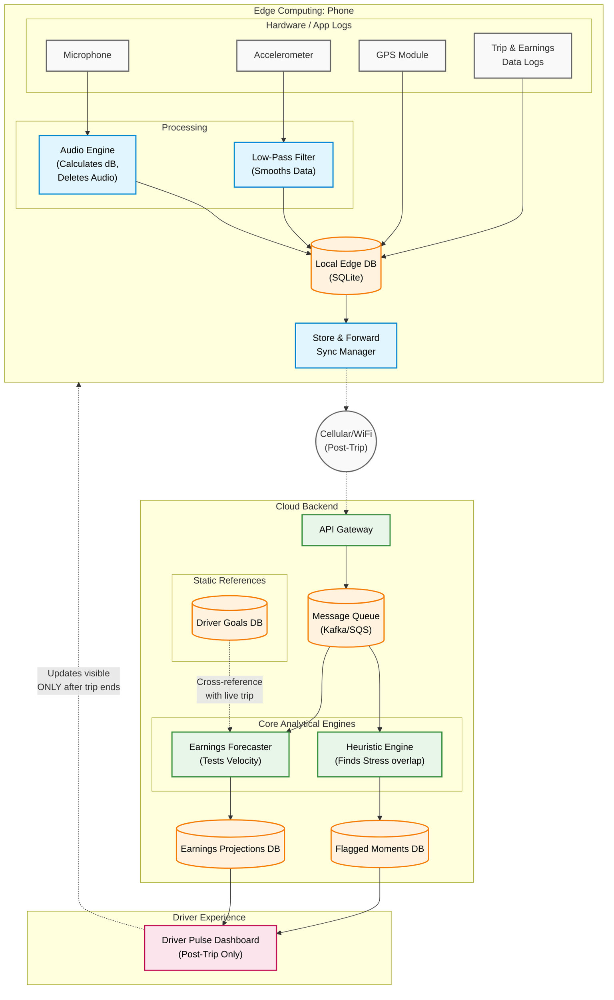

# Driver Pulse: Architectural Design Document

## 1. Vision & Core Philosophy

Driver Pulse is designed to give rideshare drivers actionable post-trip insights regarding their safety, stress levels, and earnings velocity. The core philosophy of this prototype revolves around three uncompromisable constraints of real-world deployment:
1.  **Privacy is Absolute:** Audio recording within the cabin is a massive privacy risk. No raw audio can ever leave the driver's device.
2.  **Safety First (Zero-Distraction UI):** Providing alerts or updating complex earnings graphs *during* an active trip creates dangerous cognitive load. All insights must be delivered post-trip.
3.  **Resilience to Poor Connectivity:** Drivers operate in areas with spotty cellular coverage (tunnels, rural areas). The system must gracefully handle delayed data uploads.

To achieve this, we have adopted a strict **Edge vs. Cloud Architecture**. Heavy, privacy-sensitive processing happens on the edge (the driver's phone), while historical aggregation and complex heuristics happen in the cloud.

---

## 2. Edge Computing Layer (The Driver App)

The edge layer is responsible for data collection, privacy sanitization, and intelligent buffering.

### A. Privacy-Safe Audio Processing
*   **The Problem:** We need to capture cabin noise (arguments, distress) but legally and ethically cannot transmit recordings.
*   **The Solution:** The Driver App utilizes the phone's microphone to continuously calculate **Audio Decibel (dB) Intensity**. 
*   **Mechanism:** The raw audio stream is processed in memory into 1-second rolling averages of intensity scores. The raw audio buffer is immediately flushed and destroyed. Only the numerical array (e.g., `[65.2, 70.1, 88.5...]`) is saved.

### B. Sensor Noise Reduction
*   **The Problem:** Raw 50Hz accelerometer data is massive and extremely noisy (engine vibrations, road bumps).
*   **The Solution:** The edge device applies a low-pass algorithmic filter to smooth out micro-vibrations, capturing only significant macro-movements (hard braking, swerving).

### C. The "Store-and-Forward" Sync Mechanism
*   **The Problem:** If a driver loses cellular connection during a trip, attempting to stream live data will result in packet loss and battery drain from constant retries.
*   **The Solution:** All sanitized data (audio dB arrays, filtered accelerometer arrays, speed logs) are written to a lightweight local SQLite database (or encrypted JSON lines file) on the phone. The phone only attempts a payload upload when the trip concludes and a stable connection is verified.

---

## 3. Cloud Processing Layer (The Pulse Engine)

The backend is responsible for asynchronous processing, running the detection heuristic engines, and preparing the final dashboard payload.

### A. Asynchronous Ingestion
When thousands of drivers end their trips simultaneously (e.g., rush hour), a synchronous REST API would crash.
We utilize a Message Queue (e.g., Kafka or AWS SQS). The phone uploads the compressed "Trip Telemetry Packet" to an S3 bucket, and a message is dropped onto the queue indicating `trip_id: 1234` is ready for processing.

### B. The Core Engine (Data Fusion)
Worker nodes pull messages from the queue and run the heuristic logic. This is where we combine "weak signals" into "strong indicators."
*   **Data Alignment:** Operational timestamps from `trips.csv` are used to trim the sensor data, ensuring we only analyze data that occurred strictly between passenger pickup and drop-off.
*   **The Intersection Heuristic:** If we see an isolated spike in audio (a door slamming), we ignore it. If we see a harsh brake followed immediately by a sustained 10-second spike in audio intensity, we combine these signals to flag a **"High Tension Moment."**

### C. The Earnings Velocity Forecaster

Simultaneously, the financial service cross-references the ongoing trip earnings with the driver's daily goals (`driver_goals.csv`). 

*   **The Problem:** Traditional apps only show "Total Earned Today", which doesn't tell a driver if they need to work 1 more hour or 3 more hours to hit their rent target.
*   **The Solution:** The engine calculates the driver's absolute required pace (`Remaining Target $ / Remaining Shift Hours`). It then compares this against their actual real-time `earnings_velocity`.
*   **The Output:** It replaces static numbers with a dynamic pacing indicator (e.g., **"Ahead"**, **"On Track"**, **"At Risk"**, **"Goal Achieved"**), allowing the driver to confidently log off when the system projects they will safely hit their target by shift-end.

#### The Algorithmic Logic
The mathematical framework powering `earnings_engine.py` is straightforward but highly actionable:
1.  **Safety Catch:** If `current_earnings` $\geq$ `target_earnings` $\rightarrow$ Instantly flag as **Achieved**.
2.  **Required Velocity:** `(Target $ - Current $) / Remaining Hours in Shift`
3.  **Future Projection:** `Current $ + (Current Velocity * Remaining Hours)`
4.  **Verdict:** 
    *   If `Future Projection` covers the goal $\geq$ 115%, flag as **Ahead** (they can probably clock out early).
    *   If `Future Projection` barely covers the goal, flag as **On Track**. 
    *   If it falls short, flag as **At Risk**.

---

## 4. System Architecture Diagram

### Understanding the Diagram

Here is a step-by-step breakdown of how data flows through this architecture during a real trip:

1.  **On the Phone (Edge Device):**
    *   The microphone listens to the cabin audio. The **Local Audio Engine** immediately converts that audio into simple numbers (decibels) and deletes the active recording to protect privacy.
    *   The **Accelerometer** tracks motion. That raw motion data is passed through a **Low-Pass Filter** to smooth out standard bumps in the road.
    *   All this cleaned data (plus GPS) is continuously saved to a tiny database right on the phone (**Local Edge DB**). *Nothing is sent to the internet yet.*

2.  **Sending the Data:**
    *   When the trip ends (or the driver hits a strong WiFi connection), the **Upload Manager** takes all that saved data and pushes it securely to the **Cloud Backend**. This prevents data loss if a driver drives through a tunnel mid-trip.

3.  **In the Cloud:**
    *   The data arrives at a metaphorical waiting room (the **Message Queue**). 
    *   Two engines grab the data:
        *   The **Pulse Heuristic Engine** looks for overlaps in the data (e.g., *Did a massive decibel spike happen right as the car slammed on its brakes?*). It saves these discoveries into the **Flagged Moments DB**.
        *   The **Earnings Forecaster** cross-references the length of the trip and current pay against the driver's target goals to see if they are pacing well for the day. It saves this to the **Earnings DB**.

4.  **The Result (App UI):**
    *   The driver receives a silent notification. When they look at their phone *after* the trip, the **Post-Trip Dashboard** pulls out the flagged moments and the new earnings projections from the databases and displays a clean, distraction-free summary.
